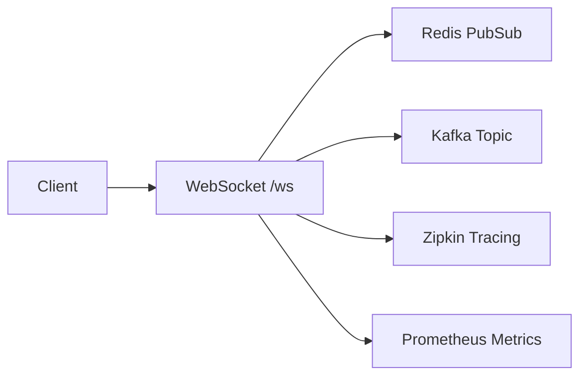

# Socket Service


A WebSocket service built in Go with distributed messaging capabilities and modern observability features.

## Features

### Core Functionality
- WebSocket endpoint at `/ws`
- JWT authentication using JWKS from Auth Service
- Real-time message broadcasting
- Presence tracking

### Integration
- Message publishing to Kafka topics
- Redis-based message distribution
- Eureka service registration
- OpenTelemetry integration with Zipkin

### Monitoring
- Prometheus metrics exposure
- Distributed tracing
- Health checks

## Quick Start

### Prerequisites
- Docker
- Docker Compose
- Go 1.21+

### Building
```bash
docker build -t socket-service:local .
```

### Configuration

#### Environment Variables
| Variable | Description | Required |
|----------|-------------|----------|
| JWKS_URL | URL for JWT Key Set | Yes |
| KAFKA_BROKERS | Kafka broker addresses | Yes |
| KAFKA_TOPIC | Target Kafka topic | Yes |
| REDIS_ADDR | Redis server address | Yes |
| ZIPKIN_URL | Zipkin server URL | Yes |
| EUREKA_URL | Eureka server URL | Yes |
| APP_NAME | Service name | Yes |
| HOST_NAME | Host name | Yes |
| SOCKET_ADDR | Socket binding address | Yes |

### Running

1. Start the required services:
```bash
docker-compose up -d
```

2. Verify the service is running:
```bash
curl http://localhost:8080/health
```

## Monitoring

- Metrics: `/metrics`
- Health: `/health`
- Traces: Available in Zipkin UI

## Architecture



## Contributing

Please read [CONTRIBUTING.md](CONTRIBUTING.md) for details on our code of conduct and the process for submitting pull requests.

## License

This project is licensed under the MIT License - see the [LICENSE](LICENSE) file for details.
